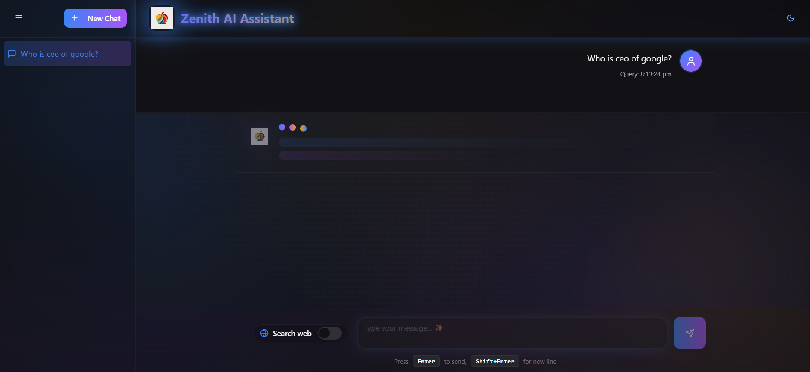
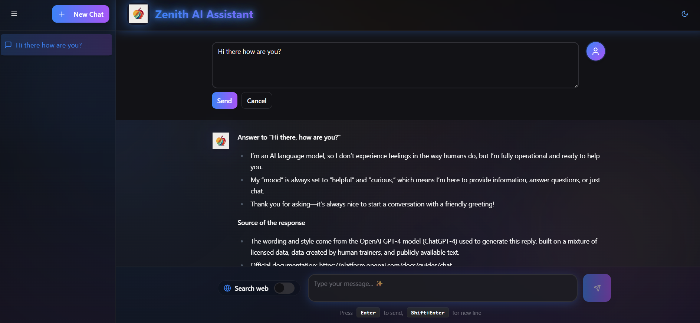

# 🌟 Zenith AI - Conscious AI Chat Assistant

> **A sophisticated, real-time AI chat application powered by OpenRouter API with conscious, thoughtful responses, beautiful UI, and advanced features.**

[](https://github.com/Ravi2ie/zenith-chat-reborn)
[](LICENSE)
[](https://nodejs.org/)
[](https://react.dev/)

---

## 📸 Application Screenshots

### Dashboard & Chat Interface
<div align="center">
  <table>
    <tr>
      <td align="center">
        
        <br/>
        <b>Main Chat Interface</b>
      </td>
      <td align="center">
        
        <br/>
        <b>Conversation History</b>
      </td>
    </tr>
    <tr>
      <td align="center">
        
        <br/>
        <b>Formatted AI Responses</b>
      </td>
      <td align="center">
        
        <br/>
        <b>Dark Mode & Themes</b>
      </td>
    </tr>
  </table>
</div>

---

## ✨ Key Features

### 🤖 AI Capabilities
- **Conscious & Thoughtful Responses**: AI answers questions with deep thinking, nuanced analysis, and comprehensive explanations
- **Real-time API Integration**: Direct integration with OpenRouter API for fresh, up-to-date responses
- **Multi-turn Conversations**: Full conversation history with context awareness
- **Response Regeneration**: Regenerate responses without re-entering the question
- **Message Editing**: Edit previous messages to explore different prompts
- **Thinking Steps Extraction**: Displays AI's reasoning process (THOUGHT: prefixes)
- **Web Search Integration**: Optional web search for real-time information

### 🎨 UI/UX Features
- **Modern Design System**: Glass morphism effects, smooth animations, and gradient backgrounds
- **Dark/Light Themes**: Toggle between themes with persistent preferences
- **Responsive Layout**: Works seamlessly on desktop and tablet devices
- **Smooth Animations**: Floating orbs, pulse effects, slide transitions, and more
- **Sidebar Navigation**: Manage conversations with collapse/expand functionality
- **Loading States**: Beautiful loading animations with bounce effects
- **Toast Notifications**: User-friendly error and success notifications

### ⚙️ Advanced Features
- **Exponential Backoff Retry Logic**: Automatic retries with intelligent backoff for rate limiting
- **Error Handling**: Comprehensive error detection and user-friendly error messages
- **Conversation Management**:
  - Create new conversations
  - Delete conversations
  - View conversation history
  - Auto-title conversations based on first message
- **Performance Optimization**: Query time tracking and response duration monitoring
- **Comprehensive Logging**: Detailed console debugging for development

---

## 🚀 Quick Start

### Prerequisites
- **Node.js** v18.0.0 or higher
- **npm** or **bun** package manager
- **OpenRouter API Key** (free tier available)
- **Supabase Account** (for backend functions)
- **SerpAPI Key** (optional, for web search)

### Installation

1. **Clone the Repository**
```bash
git clone https://github.com/Ravi2ie/zenith-chat-reborn.git
cd zenith-chat-reborn
```

2. **Install Dependencies**
```bash
npm install
# or using bun
bun install
```

3. **Configure Environment Variables**

Create a `.env` file in the project root:

```bash
# OpenRouter API Configuration
VITE_OPENROUTER_API_KEY=sk-or-v1-your-api-key-here

# Supabase Configuration
VITE_SUPABASE_PROJECT_ID=your-project-id
VITE_SUPABASE_URL=https://your-project-id.supabase.co
VITE_SUPABASE_ANON_KEY=your-anon-key

# Web Search Configuration (Optional)
SERPAPI_KEY=your-serpapi-key

# Backend Configuration
OPENROUTER_API_KEY=sk-or-v1-your-api-key-here
```

4. **Get API Keys**

- **OpenRouter API**: Get free tier key at [openrouter.ai](https://openrouter.ai/)
- **Supabase**: Set up at [supabase.com](https://supabase.com/)
- **SerpAPI** (Optional): For web search at [serpapi.com](https://serpapi.com/)

5. **Start Development Server**
```bash
npm run dev
# or
bun run dev
```

Access the application at `http://localhost:8080`

### Build for Production
```bash
npm run build
# or
bun run build
```

---

## 📁 Project Structure

```
zenith-chat-reborn/
├── src/
│   ├── pages/
│   │   ├── Index.tsx              # Main chat interface
│   │   └── NotFound.tsx           # 404 page
│   ├── components/
│   │   ├── ChatInput.tsx          # Message input component
│   │   ├── ChatMessage.tsx        # Message display component
│   │   ├── ChatSidebar.tsx        # Conversation sidebar
│   │   ├── ThemeToggle.tsx        # Dark/Light theme toggle
│   │   ├── AiIcon.tsx             # AI icon component
│   │   └── ui/                    # Shadcn/ui components
│   ├── hooks/
│   │   ├── useTheme.tsx           # Theme management hook
│   │   └── use-toast.ts           # Toast notification hook
│   ├── integrations/
│   │   └── supabase/
│   │       ├── client.ts          # Supabase client config
│   │       └── types.ts           # TypeScript types
│   ├── lib/
│   │   └── utils.ts               # Utility functions
│   ├── App.tsx                    # Main app component
│   ├── App.css                    # Global styles
│   ├── index.css                  # Custom animations
│   └── main.tsx                   # Entry point
│
├── supabase/
│   ├── config.toml                # Supabase configuration
│   └── functions/
│       └── chat-gemini/           # OpenRouter API backend
│           └── index.ts           # Backend function handler
│
├── server/
│   └── search-server/             # Web search server
│       ├── ddg_search.py          # DuckDuckGo search
│       ├── index.js               # Express server
│       └── requirements.txt       # Python dependencies
│
├── public/                         # Static assets
├── .env                           # Environment variables
├── package.json                   # Dependencies
├── vite.config.ts                 # Vite configuration
├── tailwind.config.ts             # Tailwind CSS config
├── tsconfig.json                  # TypeScript config
└── README.md                      # This file
```

---

## 🔧 Technology Stack

### Frontend
| Technology | Purpose | Version |
|-----------|---------|---------|
| **React** | UI Library | 18.3.1 |
| **TypeScript** | Type Safety | Latest |
| **Vite** | Build Tool | Latest |
| **Tailwind CSS** | Styling | 3.4.3 |
| **Shadcn/ui** | Component Library | Latest |
| **Radix UI** | Headless Components | Latest |
| **Lucide React** | Icons | 0.263.1 |
| **Sonner** | Toast Notifications | Latest |

### Backend
| Technology | Purpose |
|-----------|---------|
| **Supabase** | Backend-as-a-Service |
| **Deno** | Runtime for Edge Functions |
| **OpenRouter API** | AI Model Aggregator |
| **SerpAPI** | Web Search API (Optional) |

### Development
| Tool | Purpose |
|------|---------|
| **ESLint** | Code Linting |
| **Node.js** | Runtime |
| **npm/bun** | Package Manager |
| **Git** | Version Control |

---

## 💬 System Prompt & AI Behavior

### Conscious AI Framework

Zenith AI is configured with a comprehensive system prompt that ensures:

1. **Deep Thinking Process**
   - Breaks down questions into fundamental components
   - Considers multiple perspectives
   - Explores implications and connections
   - Challenges assumptions

2. **Structured Responses**
   - Title with relevant emoji
   - Clear introduction
   - Well-organized main content with subsections
   - Summary with key takeaways
   - Proper sources and references

3. **Quality Standards**
   - Specific and concrete examples
   - Explanations of "why" concepts
   - Real-world applications
   - Acknowledgment of complexity
   - Actionable insights

4. **Emoji Usage**
   - 1-3 emojis per paragraph
   - Context-appropriate placement
   - Visual clarity and tone adjustment
   - Consistent styling

### Model Configuration

```typescript
Model: openai/gpt-oss-20b:free
Temperature: 0.9
Top P: 0.95
Max Tokens: 2048
Retry Strategy: Exponential Backoff (1s, 2s, 4s)
```

---

## 📊 API Integration

### OpenRouter API Flow

```
User Input
    ↓
Format with System Prompt
    ↓
Send to OpenRouter API
    ↓
(Retry 3x if rate limited)
    ↓
Parse Response
    ↓
Extract Thinking Steps
    ↓
Display Formatted Answer
    ↓
Store in Conversation History
```

### Error Handling

- **Rate Limit (429)**: Automatic exponential backoff retry (3 attempts)
- **Invalid API Key (401)**: Clear error message with setup instructions
- **Network Errors**: Graceful fallback with user notification
- **Parsing Errors**: Fallback to full response display

---

## 🔐 Security Features

- ✅ **API Key Protection**: Stored in `.env`, never exposed in frontend
- ✅ **CORS Headers**: Properly configured for cross-origin requests
- ✅ **Supabase Authentication**: Edge function security
- ✅ **Input Validation**: Sanitization of user inputs
- ✅ **Error Logging**: Detailed errors for debugging without exposing sensitive data

---

## 📈 Performance Optimizations

- **Response Time Tracking**: Measures query-to-response duration
- **Conversation History Caching**: Local state management
- **Smooth Animations**: Hardware-accelerated CSS animations
- **Lazy Loading**: Components load on demand
- **Optimized Bundle**: Vite tree-shaking removes unused code

---

## 🐛 Debugging & Development

### Console Logging

The application includes comprehensive logging for development:

```
================================================================================
📩 USER INPUT RECEIVED
================================================================================
📝 Raw user input: [user message]
🔍 Input length: [chars]
⏰ Timestamp: [ISO timestamp]

📤 SENDING TO OPENROUTER API:
📋 Final prompt to API: [first 150 chars]
📚 Conversation history length: [count]

================================================================================
🤖 AI RESPONSE RECEIVED
================================================================================
⏱️  Response time (ms): [duration]
💬 Response content: [preview]
🧠 Thinking steps found: [count]
================================================================================
```

**To View Logs**: Open Browser DevTools (F12) → Console tab

### Common Issues & Solutions

| Issue | Solution |
|-------|----------|
| **Rate Limit Errors (429)** | Built-in exponential backoff; wait a moment and retry |
| **Invalid API Key** | Check `.env` file has valid `VITE_OPENROUTER_API_KEY` |
| **No Response** | Check browser console for detailed error logs |
| **Web Search Not Working** | Ensure `SERPAPI_KEY` is configured |
| **Slow Responses** | Free tier may have slower responses; consider upgrading |

---

## 🌐 Deployment

### Deploy to Vercel

1. Push code to GitHub
2. Connect repository to Vercel
3. Add environment variables in Vercel dashboard
4. Deploy with one click

### Deploy to Netlify

1. Build locally: `npm run build`
2. Connect to Netlify
3. Set build command: `npm run build`
4. Set publish directory: `dist`
5. Add environment variables

### Deploy Supabase Functions

```bash
# Install Supabase CLI
npm install -g supabase

# Login to Supabase
supabase login

# Deploy functions
supabase functions deploy chat-gemini
```

---

## 🤝 Contributing

Contributions are welcome! Please follow these steps:

1. Fork the repository
2. Create a feature branch (`git checkout -b feature/AmazingFeature`)
3. Commit changes (`git commit -m 'Add AmazingFeature'`)
4. Push to branch (`git push origin feature/AmazingFeature`)
5. Open a Pull Request

---

## 📝 License

This project is licensed under the MIT License - see the LICENSE file for details.

---

## 🙏 Acknowledgments

- **OpenRouter**: For providing unified AI API access
- **Supabase**: For backend infrastructure
- **Shadcn/ui**: For beautiful, accessible components
- **Vite**: For lightning-fast build tooling
- **Tailwind CSS**: For utility-first styling
- **SIH (Smart India Hackathon)**: For inspiring this project

---

## 📞 Support & Contact

- **Issues & Bugs**: [GitHub Issues](https://github.com/Ravi2ie/zenith-chat-reborn/issues)
- **Discussions**: [GitHub Discussions](https://github.com/Ravi2ie/zenith-chat-reborn/discussions)
- **Email**: [Contact via GitHub Profile](https://github.com/Ravi2ie)

---

## 🗺️ Roadmap

### Upcoming Features
- [ ] Voice input/output capabilities
- [ ] Multiple AI model selection
- [ ] Conversation export (PDF, Markdown, JSON)
- [ ] User authentication & cloud storage
- [ ] Plugins & extensions system
- [ ] Code highlighting with syntax support
- [ ] LaTeX math formula rendering
- [ ] User preferences & customization
- [ ] Conversation search & filtering
- [ ] Team collaboration features

### Performance Improvements
- [ ] Response streaming for faster feedback
- [ ] Message pagination for large histories
- [ ] Image support in conversations
- [ ] File upload & analysis
- [ ] Offline mode support

---

## 📊 Project Stats

- **Frontend Framework**: React 18 + TypeScript
- **Build Tool**: Vite
- **Styling**: Tailwind CSS + Custom Animations
- **Components**: 40+ Shadcn/ui components
- **Total Lines of Code**: 2000+
- **Custom Animations**: 8+
- **Git Commits**: 50+
- **Last Updated**: December 2024

---

## ✅ Feature Checklist

- ✅ Real-time AI chat with OpenRouter
- ✅ Conversation management
- ✅ Message editing & regeneration
- ✅ Web search integration
- ✅ Dark/Light themes
- ✅ Comprehensive error handling
- ✅ Beautiful UI with animations
- ✅ Thinking steps display
- ✅ Response time tracking
- ✅ Exponential backoff retry logic
- ✅ TypeScript type safety
- ✅ Responsive design
- ✅ Production-ready

---

**Made with ❤️ by [Ravi2ie](https://github.com/Ravi2ie) for SIH 2024**

⭐ If you find this project helpful, please give it a star! ⭐
